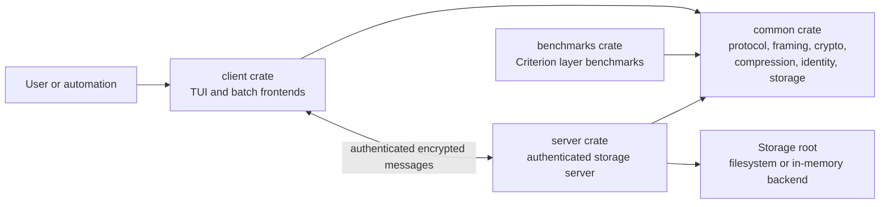
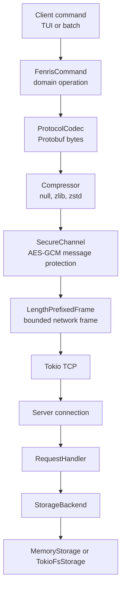
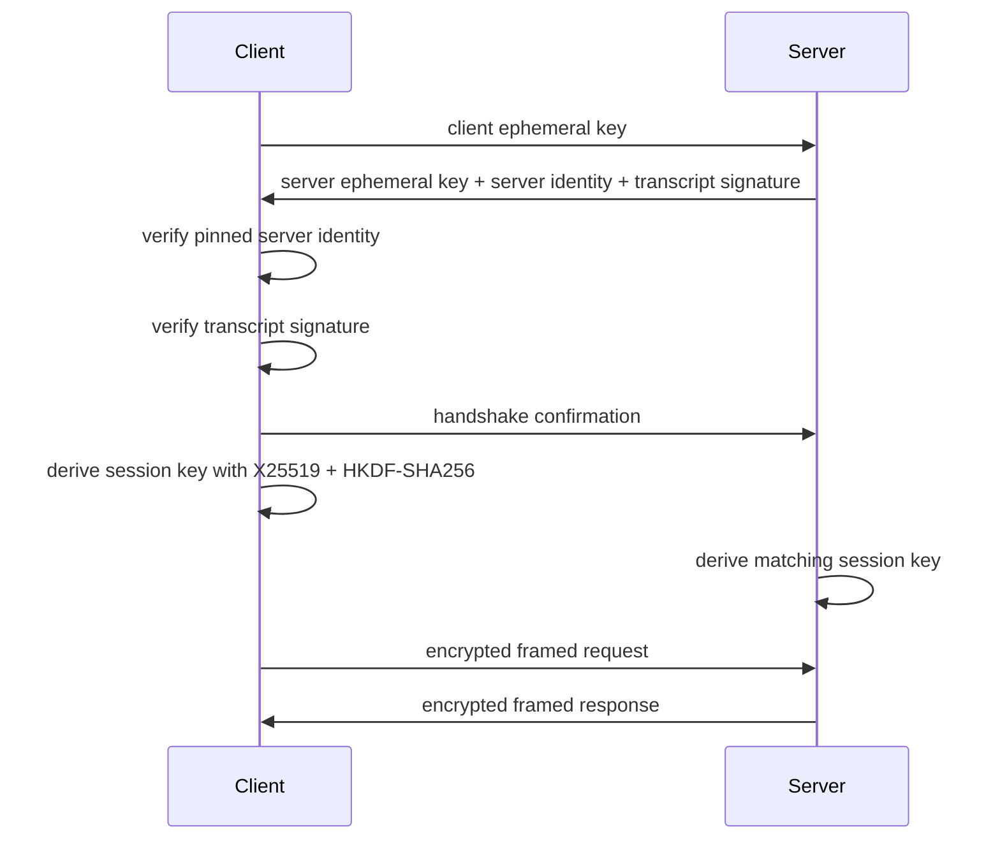
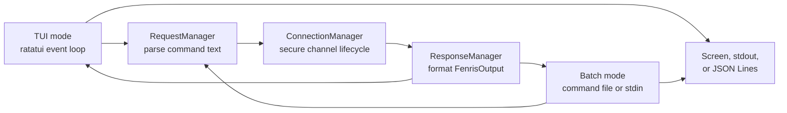
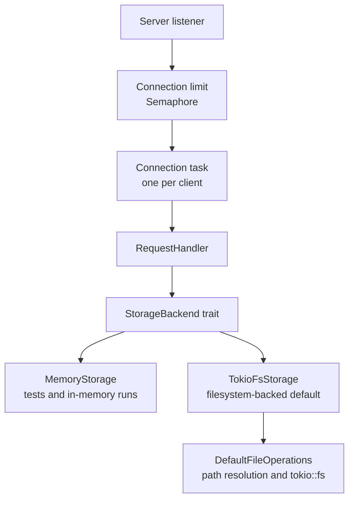
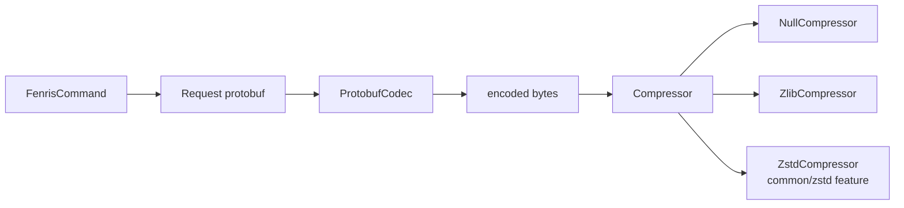
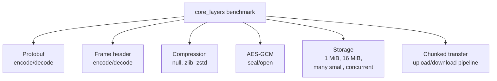

# Fenris Architecture

Fenris is a modular Rust storage stack built around explicit layer boundaries.
The reference application is an authenticated client/server object service, and
the shared crates are structured so protocol encoding, framing, compression,
encryption, request handling, and storage can evolve independently.

## System Context

The crates have distinct responsibilities:

- `common` owns the reusable contracts and default implementations.
- `client` turns user commands into typed Fenris operations and renders results.
- `server` accepts authenticated sessions and maps requests to storage actions.
- `benchmarks` measures the core layer costs without depending on a live server.

## Layered Data Path

Every major step has a small contract:

- `ProtocolCodec` converts typed requests and responses to bytes.
- `LengthPrefixedFrame` applies explicit frame limits before transport I/O.
- `Compressor` selects the compression policy statically.
- `SecureChannel` wraps transport messages in authenticated encryption.
- `StorageBackend` exposes object and namespace behavior to the server.

## Secure Channel

Fenris uses an authenticated secure-channel handshake before application
requests are processed. The server owns a persistent Ed25519 identity key, and
the client pins the expected server public key.

Message protection uses AES-256-GCM after the handshake. Framing, compression,
and protocol encoding sit inside the secure-channel message pipeline.

## Client Frontends

The client has two frontends over the same command execution path. TUI mode is
interactive; batch mode reads newline-delimited commands from a file or stdin
and writes either human-readable output or JSON Lines.

This keeps command behavior consistent across interactive and automated use
cases. Commands such as `read`, `write`, `append`, and `upload` use the chunked
transfer path for object data.

## Server and Storage

The server accepts concurrent TCP sessions, authenticates the secure channel,
and dispatches typed operations to a storage backend. The request handler works
with object and namespace operations rather than directly owning filesystem I/O.

`StorageBackend` provides:

- object operations: put, get, chunked get, append, delete, metadata
- namespace operations: create, list, delete
- type checks: exists, is object, is namespace

`TokioFsStorage` is the default backend for the server binary. `MemoryStorage`
supports fast tests and benchmark fixtures. The object/namespace vocabulary
keeps the server logic aligned with future storage backends without forcing the
user-facing command set to change.

## Protocol and Compression

The protocol layer separates typed Fenris operations from their wire encoding.
Protobuf is the default codec, while the surrounding boundaries keep the stack
ready for future codecs.

Null compression is the default stack choice. zlib is always available, and zstd
is compiled when the `common/zstd` Cargo feature is enabled.

## Benchmark Coverage

The benchmark crate measures the main layer boundaries directly. These
measurements are the evidence gate for performance work such as specialized
storage backends.

CI compiles the benchmark targets with `cargo bench -p benchmarks --no-run`.
Local timing runs use `cargo bench -p benchmarks` and produce Criterion reports
under `target/`.

## Design Direction

Fenris is designed to grow by adding focused implementations behind existing
contracts:

- storage backends can move from filesystem-backed objects to richer object
  storage designs
- compression can expand through feature-gated static choices
- protocol codecs can be introduced without rewriting client or server logic
- performance work can target measured bottlenecks instead of reshaping the
  entire stack
- Linux-specific capabilities such as io_uring and eBPF can remain optional
  backend or observability work
